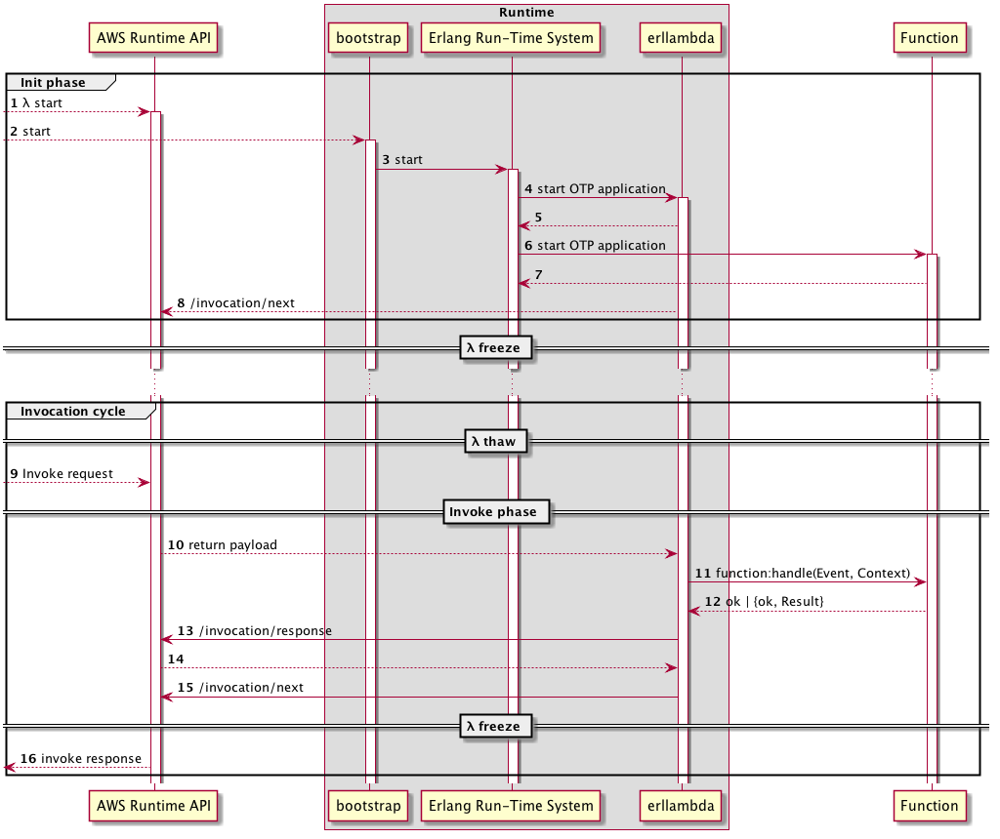

erllambda Tutorial
==================

# Provided runtime

`erllambda` is Erlang OTP application, which serves a function of a
middleman between AWS Lambda runtime service and user's lambda
function.

## Execution model

`erllambda` is a vital part of AWS Lambda functions with a provided
runtime.

It is responsible for managing a state of a function, calling
configured lambda handler and returning back result of an execution.



Diagram above illustrates runtime lifecycle.

Upon AWS Lambda invocation, provided that container with a lambda
function does not yet exist, starts a runtime by executing `bootstrap`
file (step 2 on the diagram), which in turn starts OTP release.

Please see [AWS documentation](https://docs.aws.amazon.com/lambda/latest/dg/welcome.html)
for provided runtime implementation details.

# Writing a function

Writing AWS Lambda function with `erllambda` should be as easy as
writing just an ordinary Erlang application as function is just an OTP
application, which is started in AWS Lambda environment.

## Function initialisation

Before AWS Lambda is invoked, if AWS Lambda container does not exist
yet, AWS Lambda service starts AWS Lambda container and initialise
provided runtime. This is shown on the diagram above as "Init phase".

This is usually a good time for functions to prepare environment for
further function calls. Since lambda functions written with
`erllambda` are just [OTP applications](http://erlang.org/doc/design_principles/des_princ.html#applications),
they follow the same principles as other OTP applications. When
application is started, if there's a module configured in app file:

``` erlang
{application, my_function,
 [
  %% ...
  {mod, {my_function, []}},
  %% ...
 ]}
```

On release start step `my_function:start/2` is called. This is where
function would initialise itself.

## Handle requests

Entry point to lambda function is a function `Handler:handle/2` where `Handler` is a name of a module, configured via [Handler](https://docs.aws.amazon.com/lambda/latest/dg/API_CreateFunction.html#SSS-CreateFunction-request-Handler)
parameter provided when AWS Function was created.

`Handler` module to handle requests successfully should implement `erllambda` behaviour.
There's only 1 callback that function should have:

``` erlang
-callback handle( Event :: map(), Context :: map() ) ->
    ok | {ok, iolist() | map()} | {error, iolist()}.
```

### Event

Incoming requests are received by `erllambda` from AWS Runtime API and
passed to function handler as `Event`. `Event` is JSON payload decoded
as Erlang map. Examples of events are available [here](https://docs.aws.amazon.com/lambda/latest/dg/eventsources.html).

### Context

`Context` is Erlang map which holds lambda function execution context. This includes OS environment variables (including `AWS_*`) as well as invocation related values:

| Name                                | Description                                                                                    |
|-------------------------------------|------------------------------------------------------------------------------------------------|
| lambda-runtime-aws-request-id       | AWS request ID associated with  the request                                                    |
| lambda-runtime-trace-id             | X-Ray tracing header                                                                           |
| lambda-runtime-client-context       | Information about the client application and device when invoked through the AWS Mobile SDK    |
| lambda-runtime-cognito-identity     | Information about the Amazon Cognito identity provider when invoked through the AWS Mobile SDK |
| lambda-runtime-deadline-ms          | Function execution deadline counted in milliseconds since the Unix epoch                       |
| lambda-runtime-invoked-function-arn | The ARN requested. This can be different in  each invoke that executes the same version        |


For full list of available execution environment variables see [Lambda Execution Environment and Available Libraries](https://docs.aws.amazon.com/lambda/latest/dg/current-supported-versions.html) documentation.

### Example

[Erllambda example](https://github.com/alertlogic/erllambda_example) repository contains an example of simple AWS Lambda function based on `erllambda`.

### Getting started

[rebar3 plugin](https://github.com/alertlogic/rebar3_erllambda#getting-started) for erllambda contains a great [section](https://github.com/alertlogic/rebar3_erllambda#getting-started) on how to get started with erllamda.
